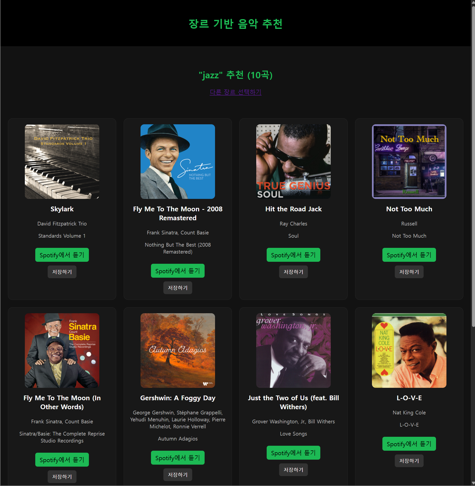

# 🎵 Spotify Genre Recommender

Flask 기반 Spotify장르 추천 서비스

사용자가 장르를 선택하면 Spotify Search API를 활용해 해당 장르의 음악을 검색 후 랜덤으로 추천해주는 간단한 음악 추천 웹 애플리케이션

---

## 📌 Features

- Spotify Search API 기반 장르 음악 검색
- 장르 검색 기능 (실시간 필터링)
- 추천 개수만큼 랜덤 선택
- Flask + Jinja2 탬플릿 기반

---

## Tech Stack

| 영역     | 기술                    |
| -------- | ----------------------- |
| Backend  | Python, Flask           |
| Frontend | HTML, CSS, JavaScript   |
| API      | Spotify Web API         |
| ETC      | requests, python-dotenv |

---

## Project Structure

```
 music_recommend
├── app.py
├── templates
│   ├── base.html
│   ├── index.html
│   └── results.html
├── static
│   └── style.css
├── img/
│   ├── index.png
│   └── results.png
├── .env
├── requirements.txt
└── README.md
```

---

## Environment Variables

루트 폴더에 `.env`파일 생성 후 아래 값 입력:

```
SPOTIFY_CLIENT_ID=your_spotify_client_id
SPOTIFY_CLIENT_SECRET=your_spotify_client_secret
APP_SECRET_KEY=any_random_string
```

Spotify Client ID/SECRET은
[Spotify](https://developer.spotify.com/dashboard)에서 앱 생성 후 발급

---

## Installation & Run

### 1. Repository Clone

```bash
git clone https://github.com/shun010116/music_recommend.git
cd YOUR_REPO
```

### 2. Install Dependencies

```bash
pip install -r requirements.txt
```

### 3. Run Flask App

```bash
python app.py
```

### 4. Access in Browser

```plain
http://127.0.0.1:5000 또는
http://localhost:5000
```

---

## How it Works

1. 사용자가 웹에서 장르 선택
2. Flask 서버에서 Spotify 토큰 발급
3. Spotify Search API 실행
4. 검색된 곡 중 랜덤으로 선택
5. 결과 페이지에서 출력

Search API 요청 예시:

```http
GET https://api.spotify.com/v1/search?q=genre:"{genre}"&type=track&limit=50
```

---

## Screenshots

기본 화면

예: jazz 검색 시 결과 반환


---
